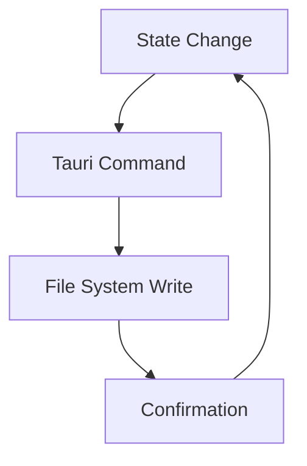
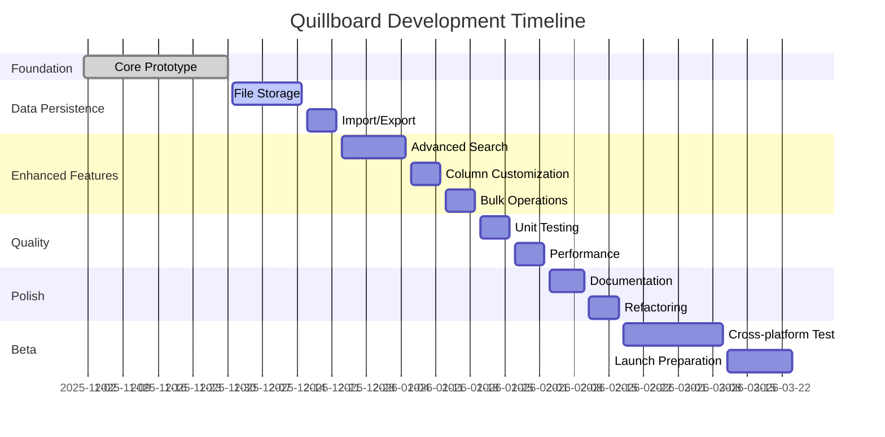

# 🪶 Quillboard Development Roadmap

## 📋 Overview

This roadmap outlines the development journey for Quillboard - a cross-platform desktop application for organizing and managing AI prompts. The project is currently in **Active Development (v0.2.0)** with data persistence implementation underway.

## 🎯 Project Vision

Quillboard aims to solve the growing problem of AI prompt management by providing a sleek, efficient way to organize, categorize, and access prompts across different workflow stages using a Kanban board metaphor.

## 🗺️ Development Phases

### Phase 1: Foundation (v0.1.0) ✅
**Status**: Completed
**Duration**: Initial development
**Focus**: Core functionality and UI prototype

**Completed Features**:
- ✅ Kanban board with drag-and-drop functionality
- ✅ Prompt cards with rich metadata (title, content, tags, icons, labels)
- ✅ Advanced LLM options (temperature, top-k, max tokens, model name)
- ✅ Search functionality with keyboard shortcut (Ctrl/Cmd + K)
- ✅ Modal-based editing and viewing interfaces
- ✅ Sample data with 5 pre-populated prompts
- ✅ Dark theme with smooth animations
- ✅ Visual feedback and toast notifications
- ✅ Responsive card layout with preview text
- ✅ Color-coded labels and icon selection

### Phase 2: Data Persistence (Current - v0.2.0) 🔄
**Status**: In Progress
**Duration**: 2-3 weeks
**Focus**: Data storage and management

**Key Objectives**:
- 🔄 Implement file-based storage using Tauri's file system APIs (In Progress)
- 🔹 Add JSON import/export functionality for backup and sharing
- 🔹 Create auto-save functionality with conflict resolution
- 🔹 Implement data validation and error handling
- 🔹 Add data migration system for future schema changes

**Technical Implementation**:

### Phase 3: Enhanced Features (v0.3.0) 🛠️
**Status**: Planned
**Duration**: 3-4 weeks
**Focus**: Advanced functionality and user experience

**Key Features**:
- 🔹 Tag-based filtering and advanced search options
- 🔹 Column customization (add/remove/rename columns)
- 🔹 Bulk operations (select multiple cards, batch edit)
- 🔹 Keyboard shortcut customization
- 🔹 Prompt templates and presets
- 🔹 Version history and undo/redo functionality
- 🔹 Enhanced mobile responsiveness

### Phase 4: Quality & Stability (v0.4.0) 🧪
**Status**: Planned
**Duration**: 2-3 weeks
**Focus**: Testing, performance, and reliability

**Key Activities**:
- 🔹 Add unit tests for core functionality (Jest/Vitest)
- 🔹 Implement integration testing
- 🔹 Performance optimization and benchmarking
- 🔹 Memory leak detection and prevention
- 🔹 Error handling and recovery mechanisms
- 🔹 Accessibility improvements (WCAG compliance)
- 🔹 Enable CSP for production security

### Phase 5: Polish & Documentation (v0.5.0) 📚
**Status**: Planned
**Duration**: 2 weeks
**Focus**: User experience and documentation

**Key Deliverables**:
- 🔹 Complete user documentation and tutorials
- 🔹 Development guides and API documentation
- 🔹 Interactive onboarding experience
- 🔹 Help system and tooltips
- 🔹 Code refactoring and modularization
- 🔹 Internationalization support (i18n)
- 🔹 Theming system with light/dark mode

### Phase 6: Beta Release (v1.0.0) 🚀
**Status**: Future
**Duration**: 4-6 weeks
**Focus**: Production readiness and launch

**Key Milestones**:
- 🔹 Cross-platform testing (Windows, macOS, Linux)
- 🔹 Installer packaging and distribution
- 🔹 Update mechanism implementation
- 🔹 Telemetry and analytics (opt-in)
- 🔹 Beta testing program
- 🔹 App store submissions
- 🔹 Marketing materials and website

## 📅 Detailed Timeline

## 🎯 Key Performance Indicators

**Development Metrics**:
- Code coverage: Target 80%+
- Test pass rate: 95%+
- Build success rate: 99%+
- Performance: < 100ms for core operations

**User Metrics**:
- Time to find prompt: < 5 seconds
- User satisfaction: 4.5/5 stars
- Retention rate: 80%+ after 30 days
- Feature adoption: 70%+ for core features

**Testing Metrics**:
- Unit test coverage: 80%+ for core business logic
- Integration test coverage: 70%+ for Tauri API interactions
- E2E test coverage: 60%+ for critical user workflows
- Test execution time: < 5 minutes for full test suite

## 🔧 Technical Roadmap

### Architecture Improvements
1. **Modular Code**: Split `main.ts` into separate modules (state, UI, utils)
2. **Storage Layer**: Abstract storage operations for easier testing
3. **Event Bus**: Centralized event management for complex interactions
4. **Component System**: Reusable UI components for better maintainability

### Technology Upgrades
1. **State Management**: Potential migration to Zustand or similar
2. **UI Framework**: Consider Preact for better performance if needed
3. **Build Optimization**: Advanced Vite configuration for smaller bundles
4. **Rust Enhancements**: Expanded native functionality

### Testing Infrastructure
1. **Vitest Setup**: Configure testing framework with Vite integration
2. **Test Utilities**: Create helper functions for common test scenarios
3. **Mock System**: Mock Tauri APIs and file system operations
4. **CI/CD Integration**: Automated testing in build pipeline

## 🧪 Testing Strategy

### Testing Timeline
**Decision**: Function testing will begin after Phase 2 (Data Persistence) is complete. This approach ensures that:
- Core functionality is stable before adding test coverage
- Data persistence layer provides a solid foundation for testing
- Tests can focus on real-world scenarios with actual data storage
- Avoids rewriting tests when data structures change during persistence implementation

### Testing Phases
1. **Phase 2 (v0.2.0)**: Foundation setup
   - Configure Vitest testing framework
   - Create test utilities and mock systems
   - Set up CI/CD integration

2. **Phase 4 (v0.4.0)**: Comprehensive testing implementation
   - **Unit Tests**: Core business logic, state management, search algorithms
   - **Integration Tests**: Tauri API calls, file system operations
   - **E2E Tests**: Critical user workflows (create/edit/delete, drag-and-drop, search)

### Test Coverage Goals
- **Unit Tests**: 80%+ coverage for core business logic
- **Integration Tests**: 70%+ coverage for Tauri API interactions
- **E2E Tests**: 60%+ coverage for critical user workflows
- **Overall**: 75%+ combined coverage target

### Testing Framework
- **Vitest**: Primary testing framework (integrates seamlessly with Vite)
- **Testing Library**: For DOM testing and user interactions
- **Mock Service Worker**: For API mocking if network features are added

## 🚨 Risk Assessment

**High Priority Risks**:
- Data loss during persistence implementation
- Performance degradation with large datasets
- Cross-platform compatibility issues
- Security vulnerabilities in file system access

**Mitigation Strategies**:
- Comprehensive testing and validation
- Performance profiling and optimization
- Continuous integration across platforms
- Security audits and code reviews

## 📊 Success Criteria

**Minimum Viable Product (MVP)**:
- ✅ Core Kanban functionality working
- ✅ Basic prompt management features
- ✅ Search and filtering capabilities
- ✅ Cross-platform compatibility
- 🔄 Data persistence implementation in progress

**Version 1.0 Goals**:
- 🔹 Reliable data persistence
- 🔹 Advanced search and organization
- 🔹 Comprehensive documentation
- 🔹 Production-ready quality
- 🔹 User testing validation

## 🔄 Feedback & Iteration

This roadmap will be regularly reviewed and updated based on:
- User feedback from testing
- Technical challenges encountered
- Market and technology changes
- Resource availability

**Review Cycle**: Monthly assessment and adjustment

## 🎓 Next Steps

1. **Immediate**: Implement data persistence (Phase 2)
2. **Short-term**: Add import/export functionality
3. **Mid-term**: Enhance search and filtering capabilities
4. **Long-term**: Prepare for beta release and user testing

> "The best way to predict the future is to invent it." - Alan Kay